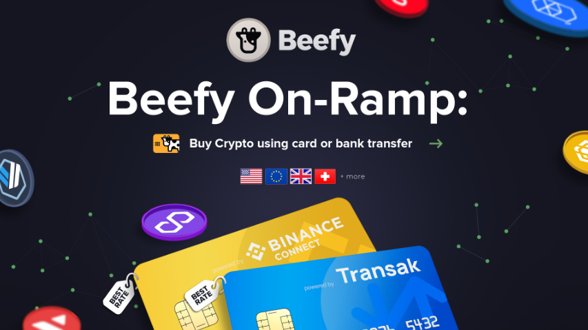

# 지갑 충전 방법

이제 지갑을 만들었으니 암호화폐 토큰으로 자금을 충전할 시간입니다. 분산 웹 거래소에서 거래하거나 NESTO의 금고에 예금을 넣는 등 블록체인에서 어떤 거래를 하려면 해당 거래에 대한 수수료를 지불하기 위해 해당 블록체인의 기본 가스 토큰이 필요합니다.\
예를 들어, 이더리움의 경우 ETH가 필요하고, BNB 체인의 경우 BNB가 필요합니다.

## 법정화폐입금(Fiat On-Ramp)

<figure><figcaption></figcaption></figure>

은행 송금이나 신용카드를 이용하여 암호화폐를 지갑에 충전할 수 있는 다양한 공급 업체들이 있습니다.\
NESTO에서는 이러한 업체들을 모아 편리하게 볼 수 있는 모듈을 제공합니다. 페이지 상단의 '암호화폐 구매' 버든을 클릭하면 법정화폐입금(Fiat On-Ramp) 프로세스가 시작되며, 가장 적합한 옵션을 선택할 수 있습니다.

## 중앙 집중식 교환 방법

Binance나 Coinbase와 같은 중앙 집중형 거래소 계정이 있다면, 자신의 지갑에 돈을 넣는 것은 상대적으로 쉽습니다. 간단히 말해서, 거래소에서 암호화폐를 자신의 지갑 주소로 보내기만 하면 됩니다. 그 과정에서 출금할 코인과 받고자 하는 암호화폐의 블록체인 네트워크를 선택하기만 하면 됩니다.

[Binance 자금 입금/인출 방법 가이드](https://www.binance.com/en/support/faq/how-do-i-deposit-withdraw-cryptocurrency-on-binance-85a1c394ac1d489fb0bfac0ef2fceafd)

[Coinbase 자금 입금/인출 가이드](https://help.coinbase.com/en/coinbase/trading-and-funding/cryptocurrency-trading-pairs/how-to-send-and-receive-cryptocurrency)
